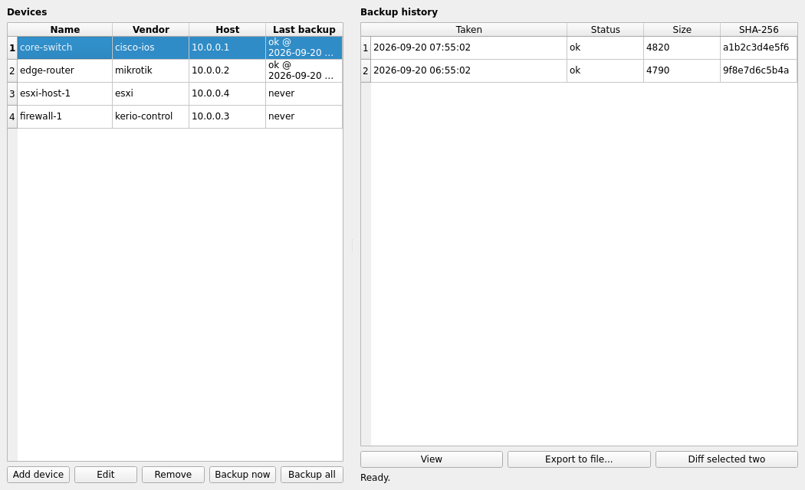

# backuprig

[](https://github.com/sasoun1366/backuprig/actions/workflows/test.yml)
[](https://www.python.org/)
[](LICENSE)
[](backuprig/gui/app.py)

A cross-platform desktop app (with a full CLI too) for backing up and
diffing configuration from mixed-vendor network and virtualization gear:
**Cisco IOS, MikroTik RouterOS, Kerio Control, VMware ESXi**, and anything
else with an SSH CLI. Pick a device, click "Backup now", and every past
backup is kept, hashed, and diffable - all encrypted at rest behind a single
master password.



## Why

Most shops end up with device configs scattered across whatever the last
person used: a folder of `.cfg` files, a personal script, someone's laptop.
backuprig is one small, honest tool: a vendor-agnostic device list, a
button that fetches and timestamps a config snapshot over SSH, and a diff
view so "what changed since Tuesday?" has an actual answer.

## Features

- **GUI (PyQt6, cross-platform: Linux/Windows/macOS)** - add devices, run
  backups, browse history, view/export/diff snapshots, all point-and-click.
- **CLI** - the same vault, scriptable for cron/systemd-timer automation on
  Unix. Add a device from the GUI, back it up nightly from cron - or the
  reverse.
- **Pluggable vendor adapters**:
  | Vendor | Transport | What it captures |
  |---|---|---|
  | Cisco IOS / IOS-XE | SSH | `show running-config` |
  | MikroTik RouterOS | SSH | `/export` (optionally `verbose`) |
  | Kerio Control | SSH (root shell) | tar of `/opt/kerio/winroute` (the live config dir) |
  | VMware ESXi | SSH | the official `vim-cmd hostsvc/firmware` config bundle |
  | Generic SSH | SSH | output of any command you specify - covers Juniper, Fortinet, HP/Aruba, Linux boxes, etc. |
- **Encrypted local vault** - a single SQLite file; every credential and
  every backup's content is encrypted with a key derived (PBKDF2-HMAC-SHA256,
  480k iterations) from your master password. Nothing is ever written to
  disk unencrypted, and the master password itself is never stored.
- **Smart diffing** - text configs get a real unified diff; binary archives
  (Kerio's tar.gz, ESXi's configBundle.tgz) get a file-level diff (added /
  removed / resized members) since a byte diff of a compressed archive isn't
  useful.
- **History, not just a snapshot** - every run is kept and hashed
  (SHA-256), so you can see exactly when something changed, not just what
  the config looks like today.

## Install

```bash
pip install "backuprig[gui]"   # GUI + CLI
pip install backuprig          # CLI only (no Qt dependency)
```

Or from source:

```bash
git clone https://github.com/sasoun1366/backuprig
cd backuprig
python -m venv .venv && . .venv/bin/activate
pip install -e ".[gui]"
```

### Windows executable (no Python required)

Every [release](https://github.com/sasoun1366/backuprig/releases) ships prebuilt, standalone
Windows binaries, built automatically on `windows-latest` by GitHub Actions:

- `backuprig-gui-<version>-windows.exe` — the desktop app.
- `backuprig-cli-<version>-windows.exe` — the command-line tool.

Just download and run — no Python or dependencies needed. To build them yourself (e.g. on your
own Windows machine), install the `packaging` extra and run PyInstaller against the provided spec
files:

```bash
pip install -e ".[packaging]"
pyinstaller packaging/backuprig-gui.spec
pyinstaller packaging/backuprig-cli.spec
# binaries land in dist/
```

## Quick start (GUI)

```bash
backuprig-gui
```

The first launch asks you to set a master password (used to encrypt
everything in the local vault - there is no recovery if you forget it, so
store it somewhere safe). After that:

1. **Add device** - pick a vendor, enter host/port/credentials (or an SSH
   key file instead of a password).
2. **Backup now** / **Backup all** - runs in the background, doesn't freeze
   the UI.
3. Select a device to see its **backup history**; select any snapshot to
   **View** or **Export to file**; select two (ctrl-click) and hit
   **Diff selected two**.

## Quick start (CLI)

```bash
# One-time: set your master password (env var avoids the prompt in scripts)
export BACKUPRIG_MASTER_PASSWORD="correct horse battery staple"

backuprig vendors                                     # list supported vendors
backuprig add core-sw cisco-ios 10.0.0.1 -u admin     # prompts for the device password
backuprig add edge-rtr mikrotik 10.0.0.2 -u admin --key ~/.ssh/id_ed25519
backuprig list                                        # show configured devices + last backup
backuprig backup 1                                    # back up device #1 now
backuprig backup --all                                # back up everything (good for cron)
backuprig history 1                                   # list past backups for device #1
backuprig export 3 core-sw-2026-09-20.cfg             # dump a stored backup to a file
backuprig diff 2 3                                    # diff two stored backups
```

Example cron entry for nightly backups of everything:

```
0 2 * * * BACKUPRIG_MASTER_PASSWORD="..." /usr/local/bin/backuprig backup --all >> /var/log/backuprig.log 2>&1
```

The vault (`~/.backuprig/backuprig.db` by default, override with
`--db`/`BACKUPRIG_DB`) is a single file shared by the GUI and CLI - add
devices in one, back them up from the other.

## Vendor notes

- **Cisco IOS**: needs an SSH-enabled account with enough privilege to run
  `show running-config` (typically privilege 15, or an `enable` account).
- **MikroTik**: any user in a group with SSH policy; use `--show-sensitive`
  (CLI) or the "Verbose export" checkbox (GUI) to include secrets like
  pre-shared keys via `/export verbose` - off by default.
- **Kerio Control**: SSH access is disabled by default. Enable it in the
  admin console under **Status > System Health > Enable SSH**, then use the
  `root` account. backuprig archives `/opt/kerio/winroute` (the directory
  Kerio's own KB documents as the live config store, chiefly
  `winroute.cfg`) - override the path per-device if yours differs.
- **ESXi**: the SSH service must be enabled (`vim-cmd hostsvc/... ` requires
  it) and the `root` account (or a role with equivalent firmware
  permissions). This runs the same `sync_config` / `backup_config` flow
  documented by VMware/Broadcom for CLI-based host backups.
- **Generic SSH**: set a custom command per device, e.g.
  `show configuration | display set` for Juniper, or
  `show full-configuration` for Fortinet.

## Security model

- The master password derives a Fernet key via PBKDF2-HMAC-SHA256 (480,000
  iterations) with a random per-vault salt; a small verifier token detects a
  wrong password with a clear error instead of corrupting data.
- Every device credential (password, key path) and every backup's content
  is encrypted individually before being written to SQLite.
- SSH host keys are currently auto-accepted on first connect (like most
  lightweight SSH tools) - if you need strict host key pinning, open an
  issue or a PR; it's on the roadmap.
- backuprig only ever reads configuration from devices. It never pushes or
  modifies anything.

## Development

```bash
python -m venv .venv && . .venv/bin/activate
pip install -e ".[dev]"        # core (no GUI deps)
pytest -q

pip install -e ".[dev-gui]"    # + PyQt6, for GUI tests
QT_QPA_PLATFORM=offscreen pytest -q tests/test_gui.py
```

All adapter and engine logic is unit-tested with fake SSH sessions (no
real device or network access needed); the transport layer was also
verified against a real local SSHD during development. GUI tests run
headless via Qt's `offscreen` platform plugin.

Contributions welcome - see [CONTRIBUTING.md](CONTRIBUTING.md). New vendor
adapters are especially welcome (Juniper, Fortinet, HP/Aruba native support,
etc.) - the adapter interface is a small, pure-function contract, see
`backuprig/adapters/base.py`.

## Roadmap

- [ ] Scheduled backups from inside the GUI (not just cron)
- [ ] Strict SSH host key verification / known_hosts support
- [ ] Native Juniper (`display set`) and Fortinet adapters
- [ ] Restore helpers (push a stored backup back to a device) - deliberately
      left out of v0.1 since "read-only by default" is a safer starting
      point
- [ ] Packaged installers (PyInstaller) for Windows/macOS so non-Python
      users can just run it

<!-- support:start -->
## Support the project

**backuprig** is built and maintained in my own time, and it stays free to use
and free to fork. If it saved you an outage — or just an afternoon — you can help
fund the next round of test hardware and the time to add more vendors:

**USDT (TRC20)**

```text
TMEyd1JZqdCjjKTc4zG2fhjzAYFKXCUWnA
```

This is the only address I publish for these projects. Anything else claiming to be
me is not mine.
<!-- support:end -->

## License

MIT - see [LICENSE](LICENSE).
